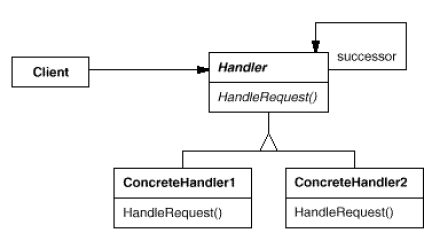

# **Chain of Responsibility** in **C#**

## Overview

This project demonstrates the **Chain of Responsibility** pattern using a practical example of **a GUI help system where help requests propagate from a button to a dialog and then to the application**.

The **Chain of Responsibility** is a **behavioral** pattern that **decouples the sender of a request from its receiver by allowing multiple objects to handle the request dynamically**.

In this example, we have:

* **`HelpHandler`**: The abstract handler defining the interface for handling help requests and maintaining a reference to its successor.
* **`Widget`**: A base class for UI elements that can handle help requests.
* **`Button`**: A concrete handler that provides help specific to a button.
* **`Dialog`**: A concrete handler that provides help for a dialog window.
* **`Application`**: The final handler that provides general help if no specific handler handles the request.

---

## Structure

### Diagram



### 1. Core Interface / Abstract Class

* **`HelpHandler`**: Defines `HandleHelp()` and keeps a reference to the successor handler.

### 2. Concrete Implementations

* **`Button`**: Handles button-specific help requests; forwards if none exist.
* **`Dialog`**: Handles dialog-specific help requests; forwards if none exist.
* **`Application`**: Handles application-wide help requests; final fallback in the chain.

### 3. Client

* **`Main Program`**: Initiates a help request by calling `HandleHelp()` on a button, triggering propagation through the chain.

---

## Example Usage

```csharp
using System;

class Program
{
    static void Main()
    {
        Application app = new Application("General Application Help");
        Dialog dialog = new Dialog(app, "Print Dialog Help");
        Button button = new Button(dialog, "Print Button Help");

        // Initiate help request
        button.HandleHelp();
    }
}

abstract class HelpHandler
{
    protected HelpHandler successor;
    protected string helpTopic;

    public HelpHandler(HelpHandler successor, string topic = null)
    {
        this.successor = successor;
        this.helpTopic = topic;
    }

    public virtual void HandleHelp()
    {
        if (successor != null)
        {
            successor.HandleHelp();
        }
        else
        {
            Console.WriteLine("No help available.");
        }
    }

    protected bool HasHelp()
    {
        return !string.IsNullOrEmpty(helpTopic);
    }
}

class Button : HelpHandler
{
    public Button(HelpHandler successor, string topic = null) : base(successor, topic) { }

    public override void HandleHelp()
    {
        if (HasHelp())
        {
            Console.WriteLine(helpTopic);
        }
        else
        {
            base.HandleHelp();
        }
    }
}

class Dialog : HelpHandler
{
    public Dialog(HelpHandler successor, string topic = null) : base(successor, topic) { }

    public override void HandleHelp()
    {
        if (HasHelp())
        {
            Console.WriteLine(helpTopic);
        }
        else
        {
            base.HandleHelp();
        }
    }
}

class Application : HelpHandler
{
    public Application(string topic = null) : base(null, topic) { }

    public override void HandleHelp()
    {
        if (HasHelp())
        {
            Console.WriteLine(helpTopic);
        }
        else
        {
            base.HandleHelp();
        }
    }
}
````

### Output:

```
Print Button Help
```

---

## Benefits

* **Reduced coupling**: The sender of the request (button) does not need to know which object will handle it.
* **Flexible assignment of responsibilities**: You can dynamically change or extend the chain without modifying existing classes.
* **Simplifies object interconnections**: Each handler only needs to know its successor.

---

## Common Use Cases

* GUI frameworks for handling user events (mouse clicks, key presses).
* Logging frameworks where multiple loggers can handle messages.
* Workflow or approval systems where multiple objects may process a request in sequence.
* Command processing systems that forward commands to parent components if unhandled.

```
