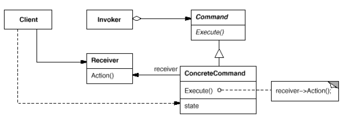

# **Command Pattern** in **C#**

## Overview

This project demonstrates the **Command Pattern** using a practical example of **a text editor where menu items perform actions like Open, Paste, and macro commands**.

The **Command Pattern** is a **behavioral** pattern that **encapsulates a request as an object, decoupling the sender of the request from the object that knows how to execute it**.

In this example, we have:

* **`Command`**: Declares an interface for executing operations.
* **`ConcreteCommand`**: Implements the `Command` interface and binds a receiver to an action.
* **`Invoker`**: Holds a command and triggers its execution (e.g., menu item).
* **`Receiver`**: Knows how to perform the actual operations (e.g., Document).

---

## Structure

### Diagram



### 1. Core Interface / Abstract Class

* **`ICommand`**: Defines the `Execute()` method.

### 2. Concrete Implementations

* **`OpenCommand`**: Opens a document.
* **`PasteCommand`**: Pastes content into a document.
* **`MacroCommand`**: Executes a sequence of commands.

### 3. Client

* **`Application`**: Creates commands, sets receivers, and assigns commands to menu items.

### 4. Invoker

* **`MenuItem`**: Holds a command and calls `Execute()` when triggered.

---

## Example Usage

```csharp
// Receivers
class Document {
    public void Open() => Console.WriteLine("Document opened.");
    public void Paste() => Console.WriteLine("Content pasted.");
}

// Command Interface
interface ICommand {
    void Execute();
}

// Concrete Commands
class OpenCommand : ICommand {
    private Document _document;
    public OpenCommand(Document doc) { _document = doc; }
    public void Execute() { _document.Open(); }
}

class PasteCommand : ICommand {
    private Document _document;
    public PasteCommand(Document doc) { _document = doc; }
    public void Execute() { _document.Paste(); }
}

// Invoker
class MenuItem {
    private ICommand _command;
    public MenuItem(ICommand command) { _command = command; }
    public void Click() { _command.Execute(); }
}

// Client
class Program {
    static void Main() {
        Document doc = new Document();
        
        ICommand openCmd = new OpenCommand(doc);
        ICommand pasteCmd = new PasteCommand(doc);
        
        MenuItem openMenu = new MenuItem(openCmd);
        MenuItem pasteMenu = new MenuItem(pasteCmd);
        
        openMenu.Click();
        pasteMenu.Click();
    }
}
```

### Output

```cmd
Document opened.
Content pasted.
```

---

## Benefits

* **Decouples invoker from receiver**: Menu items don’t need to know the details of the actions they perform.
* **Supports undo/redo and macros**: Commands can be stored, reversed, or combined.
* **Commands are first-class objects**: Can be passed, queued, or logged.
* **Easy to extend**: New commands can be added without changing existing code.

---

## Common Use Cases

* GUI applications with buttons or menus triggering actions.
* Undo/redo systems in editors.
* Macro recording and playback.
* Queued or delayed execution of operations.
