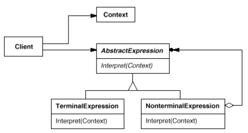

# **Interpreter Pattern** in **C\#**

## Overview

This project demonstrates the **Interpreter Pattern** using a practical example of **evaluating simple mathematical expressions**.

The **Interpreter Pattern** is a **behavioral** pattern that **defines a representation for a language's grammar and an interpreter that uses this representation to process sentences in the language**.

In this example, we have:

* **`AbstractExpression`**: Declares the `Interpret` operation, common to all expression types.
* **`TerminalExpression`**: Represents the terminal symbols (e.g., numbers/literals) in the grammar.
* **`NonterminalExpression`**: Represents the nonterminal symbols (e.g., `Add`, `Subtract`) which recursively call `Interpret` on their sub-expressions.
* **`Context`**: Holds global information needed for the interpretation (in this case, it's not strictly necessary for simple math but is part of the standard pattern).

-----

## Structure

### Diagram



### 1\. Core Interface / Abstract Class

* **`AbstractExpression`**: Defines the abstract `Interpret(Context context)` method.

### 2\. Concrete Implementations

* **`NumberExpression`**: Implements `Interpret` for terminal symbols (integers). It retrieves its value from the `Context`.
* **`AddExpression`**: Implements `Interpret` for the addition operation. It recursively calls `Interpret` on its two sub-expressions (operands) and returns their sum.
* **`SubtractExpression`**: Implements `Interpret` for the subtraction operation. It recursively calls `Interpret` on its two sub-expressions and returns their difference.

### 3\. Context

* **`Context`**: Stores the variables or literal values used by the `TerminalExpression` nodes. For this simple example, it's a minimal class or a dictionary storing the literal values of the `NumberExpression` nodes, although in this simple math example, we'll embed the number in the `NumberExpression` for simplicity and just have a placeholder context.

### 4\. Client

* **`Client`**: Builds the Abstract Syntax Tree (AST) using instances of the concrete expression classes and invokes the `Interpret` operation on the root of the tree.

-----

## Example Usage

```csharp
using System;

// 1. Context (Minimal for this example)
public class Context
{
    // A more complex example (e.g., variable assignment) would use this
    public string GlobalInfo { get; set; } = "Interpretation started.";
}

// 2. Core Interface / Abstract Class
public abstract class AbstractExpression
{
    public abstract int Interpret(Context context);
}

// 3. Concrete Implementations (TerminalExpression)
public class NumberExpression : AbstractExpression
{
    private readonly int _number;

    public NumberExpression(int number)
    {
        _number = number;
    }

    public override int Interpret(Context context)
    {
        Console.WriteLine($"Interpreting Number: {_number}");
        return _number;
    }
}

// 3. Concrete Implementations (NonterminalExpression - Add)
public class AddExpression : AbstractExpression
{
    private readonly AbstractExpression _leftOperand;
    private readonly AbstractExpression _rightOperand;

    public AddExpression(AbstractExpression left, AbstractExpression right)
    {
        _leftOperand = left;
        _rightOperand = right;
    }

    public override int Interpret(Context context)
    {
        int leftResult = _leftOperand.Interpret(context);
        int rightResult = _rightOperand.Interpret(context);
        int result = leftResult + rightResult;
        Console.WriteLine($"Interpreting Add: {leftResult} + {rightResult} = {result}");
        return result;
    }
}

// 3. Concrete Implementations (NonterminalExpression - Subtract)
public class SubtractExpression : AbstractExpression
{
    private readonly AbstractExpression _leftOperand;
    private readonly AbstractExpression _rightOperand;

    public SubtractExpression(AbstractExpression left, AbstractExpression right)
    {
        _leftOperand = left;
        _rightOperand = right;
    }

    public override int Interpret(Context context)
    {
        int leftResult = _leftOperand.Interpret(context);
        int rightResult = _rightOperand.Interpret(context);
        int result = leftResult - rightResult;
        Console.WriteLine($"Interpreting Subtract: {leftResult} - {rightResult} = {result}");
        return result;
    }
}

// 4. Client
public class Client
{
    public static void Main(string[] args)
    {
        // Define the expression: (4 - 2) + 5
        
        // Left side: 4 - 2
        AbstractExpression four = new NumberExpression(4);
        AbstractExpression two = new NumberExpression(2);
        AbstractExpression subtractExp = new SubtractExpression(four, two);

        // Right side: 5
        AbstractExpression five = new NumberExpression(5);

        // Root expression: (4 - 2) + 5
        AbstractExpression rootExpression = new AddExpression(subtractExp, five);

        Context context = new Context();

        Console.WriteLine($"Context: {context.GlobalInfo}\n");
        Console.WriteLine("--- Interpretation Trace ---");

        // Interpret the entire expression
        int finalResult = rootExpression.Interpret(context);

        Console.WriteLine("\n--- Final Result ---");
        Console.WriteLine($"The result of (4 - 2) + 5 is: {finalResult}");
    }
}
```

### Output

```cmd
Context: Interpretation started.

--- Interpretation Trace ---
Interpreting Number: 4
Interpreting Number: 2
Interpreting Subtract: 4 - 2 = 2
Interpreting Number: 5
Interpreting Add: 2 + 5 = 7

--- Final Result ---
The result of (4 - 2) + 5 is: 7
```

-----

## Benefits

* **`Ease of Grammar Extension`**: New ways to evaluate or new grammar rules can be easily added by creating new concrete expression classes, leveraging **inheritance**.
* **`Easy Implementation of Grammar`**: The classes defining nodes in the Abstract Syntax Tree (AST) have a similar, straightforward implementation structure.
* **`Simple Grammar Representation`**: The pattern provides a clear, object-oriented way to represent the grammar as an AST, which directly maps to the language's rules.

-----

## Common Use Cases

* **`SQL Query Parsers`**: Interpreting parts of a WHERE clause or HAVING clause.
* **`Regular Expressions`**: As described in the motivation, a regular expression can be represented as an AST and interpreted to perform pattern matching.
* **`Simple Scripting/Macro Languages`**: When a basic language is needed for application customization, like evaluating simple Boolean or mathematical expressions.
