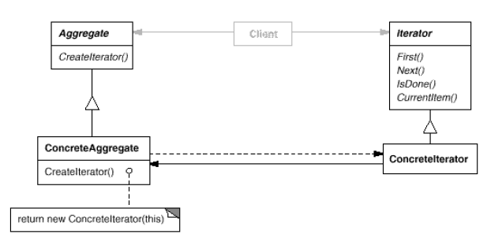

# **ITERATOR** in **C\#**

## Overview

This project demonstrates the **Iterator** pattern using a practical example of **traversing a collection of employees without knowing its internal structure**.

The **Iterator** is a **behavioral** pattern that **provides a way to access the elements of an aggregate object sequentially without exposing its underlying representation**. It is often referred to as a **Cursor**.

In this example, we have:

* **`AbstractAggregate` (IEmployeeCollection)**: Defines the interface for creating an `Iterator` object.
* **`ConcreteAggregate` (EmployeeList)**: Implements the `AbstractAggregate` interface to return an instance of a concrete iterator, such as `EmployeeIterator`.
* **`AbstractIterator` (IIterator)**: Defines the interface for accessing and traversing the aggregate's elements (`First`, `Next`, `IsDone`, `CurrentItem`).
* **`ConcreteIterator` (EmployeeIterator)**: Implements the `IIterator` interface and keeps track of the current position in the `EmployeeList`.
* **`Client` (Program)**: Uses the `IIterator` to traverse the `IEmployeeCollection` without direct knowledge of the collection's internal structure.

-----

## Structure

### Diagram



### 1\. Core Interface / Abstract Class

* **`IIterator<T>`**: The abstract iterator interface defining the traversal operations.

    ```csharp
    public interface IIterator<T>
    {
        void First();
        T CurrentItem();
        void Next();
        bool IsDone();
    }
    ```

* **`IEmployeeCollection`**: The aggregate interface, which defines the method for creating an iterator. This is the **Factory Method** connection point.

    ```csharp
    public interface IEmployeeCollection
    {
        IIterator<Employee> CreateIterator();
        // Other collection methods, e.g., Add, GetCount, etc.
    }
    ```

### 2\. Concrete Implementations

* **`Employee`**: A simple class representing the objects in the collection.

    ```csharp
    public class Employee
    {
        public string Name { get; set; }
        // ...
    }
    ```

  * **`EmployeeIterator`**: The concrete iterator that traverses the `EmployeeList`.

    ```csharp
    public class EmployeeIterator : IIterator<Employee>
    {
        // Keeps track of the collection and the current position (_current)
        // ... implements IIterator<Employee> ...
    }
    ```

  * **`EmployeeList`**: The concrete aggregate that holds the employees and implements `CreateIterator`.

    ```csharp
    public class EmployeeList : IEmployeeCollection
    {
        private List<Employee> _employees = new List<Employee>();
        // ... implements CreateIterator ...
    }
    ```

### 3\. Client

* **`Program`**: The client code that requests an iterator from the aggregate and uses it to traverse the collection. It is decoupled from the concrete `EmployeeList` and `EmployeeIterator` classes.

-----

## Example Usage

```csharp
using System;
using System.Collections.Generic;

// --- 1. The Item ---
public class Employee
{
    public string Name { get; set; }
    public string Title { get; set; }

    public Employee(string name, string title)
    {
        Name = name;
        Title = title;
    }

    public void Print()
    {
        Console.WriteLine($"\t- {Name} ({Title})");
    }
}

// --- 2. The Abstract Iterator ---
public interface IIterator<T>
{
    void First();
    T CurrentItem();
    void Next();
    bool IsDone();
}

// --- 3. The Abstract Aggregate ---
public interface IEmployeeCollection
{
    IIterator<Employee> CreateIterator();
    int Count { get; }
    Employee Get(int index);
}

// --- 4. The Concrete Aggregate ---
public class EmployeeList : IEmployeeCollection
{
    private List<Employee> _employees = new List<Employee>();

    public EmployeeList()
    {
        // Initialize with some data
        _employees.Add(new Employee("Alice", "CEO"));
        _employees.Add(new Employee("Bob", "CTO"));
        _employees.Add(new Employee("Charlie", "Developer"));
    }

    public void Add(Employee employee)
    {
        _employees.Add(employee);
    }

    public IIterator<Employee> CreateIterator()
    {
        // This is the Factory Method
        return new EmployeeIterator(this);
    }

    public int Count => _employees.Count;

    public Employee Get(int index) => _employees[index];
}

// --- 5. The Concrete Iterator (External Iterator) ---
public class EmployeeIterator : IIterator<Employee>
{
    private readonly EmployeeList _list;
    private int _current = 0;

    public EmployeeIterator(EmployeeList list)
    {
        _list = list;
    }

    public void First()
    {
        _current = 0;
    }

    public Employee CurrentItem()
    {
        if (IsDone())
        {
            throw new InvalidOperationException("Iterator is out of bounds.");
        }
        return _list.Get(_current);
    }

    public void Next()
    {
        _current++;
    }

    public bool IsDone()
    {
        return _current >= _list.Count;
    }
}

// --- 6. The Client (Usage) ---
public class Program
{
    public static void PrintEmployees(IIterator<Employee> iterator)
    {
        for (iterator.First(); !iterator.IsDone(); iterator.Next())
        {
            iterator.CurrentItem().Print();
        }
    }

    public static void Main(string[] args)
    {
        Console.WriteLine("Creating Employee List...");
        IEmployeeCollection employees = new EmployeeList();
        
        // Add a new employee later
        (employees as EmployeeList).Add(new Employee("David", "Manager"));

        Console.WriteLine("\nTraversing Collection using the Iterator:");
        IIterator<Employee> iterator = employees.CreateIterator();
        
        PrintEmployees(iterator);

        Console.WriteLine("\nTraversal Complete.");
    }
}
```

### Output

```cmd
Creating Employee List...

Traversing Collection using the Iterator:
- Alice (CEO)
- Bob (CTO)
- Charlie (Developer)
- David (Manager)

Traversal Complete.
```

-----

## Benefits

* **Supports Variations in Traversal**: You can easily create new `ConcreteIterator` classes (e.g., `ReverseEmployeeIterator`, `FilteredEmployeeIterator`) to provide different traversal policies without changing the aggregate's interface.
* **Decouples Aggregate and Traversal Logic**: The `EmployeeList` (Aggregate) does not need to contain traversal methods like `GetNextEmployee()` or `ResetPosition()`. This simplifies the **Aggregate interface** and places the responsibility for iteration in the separate `Iterator` object.
* **Supports Multiple Concurrent Traversals**: Since each `ConcreteIterator` instance keeps track of its own traversal state (the `_current` index), multiple traversals can be in progress on the same collection simultaneously.

-----

## Common Use Cases

* **Standard Library Collections**: The most common use is in collection libraries. In C\#, the built-in interfaces `IEnumerable` and `IEnumerator` are a direct implementation of the Iterator pattern (the `foreach` loop relies on them).
* **Complex Data Structures**: Traversing complex or recursive structures like **Trees** (preorder, inorder, postorder) or **Composites**, where the traversal logic is intricate and should be separated from the node structure.
* **Hiding Internal Representation**: When an aggregate object's elements are stored in a non-standard way (e.g., a custom linked list or a sparse array), the Iterator pattern ensures clients don't need to know the internal storage details to process the elements.