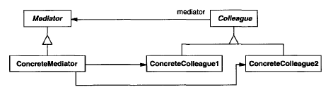

# **Mediator** in **C\#**

## Overview

This project demonstrates the **Mediator** design pattern using a practical example of **coordinating the interactions of widgets (like a ListBox and an EntryField) in a dialog box**.

The **Mediator** is a **behavioral** pattern that **defines an object that encapsulates how a set of objects interact, promoting loose coupling by centralizing communication**.

In this example, we have:

* **`DialogDirector`**: The abstract **Mediator**, defining the interface for colleagues to communicate with.
* **`FontDialogDirector`**: The concrete **Mediator**, which coordinates the widget interactions (Colleagues).
* **`Widget`**: The abstract **Colleague**, defining a common interface and maintaining a reference to its Mediator.
* **`ListBox`, `EntryField`, `Button`**: Concrete **Colleagues** that communicate through the Mediator.

-----

## Structure

### Diagram



### 1\. Core Interface / Abstract Class

* **`DialogDirector`**: An abstract class that acts as the **Mediator**. It defines the `WidgetChanged(Widget)` method that concrete widgets call to notify the director of a change.
* **`Widget`**: An abstract class that acts as the **Colleague**. It holds a reference to its `DialogDirector` and provides the `Changed()` method for subclasses to notify the director.

### 2\. Concrete Implementations

* **`FontDialogDirector`**: The concrete **Mediator**. It implements `WidgetChanged(Widget)` to handle specific interactions, like transferring selection from a `ListBox` to an `EntryField` or enabling a `Button`. It knows and maintains references to its specific colleagues.
* **`ListBox`, `EntryField`, `Button`**: Concrete **Colleagues**. Instead of communicating directly, they call the `Changed()` method, which delegates the notification to the `FontDialogDirector`.

### 3\. Client

* **`Application` (Implicit in `Main` method)**: The client code creates the **ConcreteMediator** (`FontDialogDirector`) and implicitly uses it when simulating user actions that trigger changes in the widgets.

-----

## Example Usage

```c#
using System;
using System.Collections.Generic;

// 1. Core Interface / Abstract Class (Mediator)
public abstract class DialogDirector
{
    public abstract void WidgetChanged(Widget widget);
    protected abstract void CreateWidgets();
}

// 1. Core Interface / Abstract Class (Colleague)
public abstract class Widget
{
    protected DialogDirector _director;

    public Widget(DialogDirector director)
    {
        _director = director;
    }

    public void Changed()
    {
        _director.WidgetChanged(this);
    }
}

// 2. Concrete Implementations (Colleagues)

public class ListBox : Widget
{
    private string _selection = "Times New Roman";

    public ListBox(DialogDirector director) : base(director) { }

    public string GetSelection() => _selection;

    public void SetSelection(string selection)
    {
        Console.WriteLine($"ListBox: Selection changed to '{selection}'.");
        _selection = selection;
        Changed(); // Notify the director
    }
}

public class EntryField : Widget
{
    private string _text = "";

    public EntryField(DialogDirector director) : base(director) { }

    public void SetText(string text)
    {
        Console.WriteLine($"EntryField: Text set to '{text}'.");
        _text = text;
        Changed(); // Notify the director (e.g., if the user types)
    }

    public string GetText() => _text;
}

public class Button : Widget
{
    public string Text { get; }
    public bool IsEnabled { get; set; }

    public Button(DialogDirector director, string text) : base(director)
    {
        Text = text;
        IsEnabled = false;
    }

    public void SimulatePress()
    {
        if (IsEnabled)
        {
            Console.WriteLine($"Button '{Text}' pressed. Director will handle action.");
            Changed(); // Notify the director
        }
        else
        {
            Console.WriteLine($"Button '{Text}' is disabled.");
        }
    }

    public void SetEnabled(bool enabled)
    {
        IsEnabled = enabled;
        Console.WriteLine($"Button '{Text}' is now {(enabled ? "ENABLED" : "DISABLED")}.");
    }
}

// 2. Concrete Implementations (Mediator)
public class FontDialogDirector : DialogDirector
{
    private ListBox _fontList;
    private EntryField _fontName;
    private Button _okButton;
    private Button _cancelButton;

    public FontDialogDirector()
    {
        CreateWidgets();
    }

    protected override void CreateWidgets()
    {
        // Colleagues are created and given a reference to the director (this)
        _fontList = new ListBox(this);
        _fontName = new EntryField(this);
        _okButton = new Button(this, "OK");
        _cancelButton = new Button(this, "Cancel");

        // Initial setup: OK button is disabled if EntryField is empty
        _okButton.SetEnabled(!string.IsNullOrEmpty(_fontName.GetText()));

        Console.WriteLine("Font Dialog initialized.");
    }

    // This is the heart of the Mediator pattern's control logic
    public override void WidgetChanged(Widget theChangedWidget)
    {
        if (theChangedWidget == _fontList)
        {
            // 1. ListBox changed selection
            // 2. Director gets selection
            string selection = _fontList.GetSelection();
            
            // 3. Director passes selection to EntryField
            _fontName.SetText(selection);

            // 4. Director enables/disables OK button based on EntryField content
            _okButton.SetEnabled(!string.IsNullOrEmpty(_fontName.GetText()));
        }
        else if (theChangedWidget == _fontName)
        {
             // EntryField changed (e.g., user typed text)
            _okButton.SetEnabled(!string.IsNullOrEmpty(_fontName.GetText()));
        }
        else if (theChangedWidget == _okButton)
        {
            Console.WriteLine("Action: Applying font change and dismissing dialog.");
        }
        else if (theChangedWidget == _cancelButton)
        {
            Console.WriteLine("Action: Dismissing dialog without changes.");
        }
    }

    // Utility for the client to initiate the demonstration
    public ListBox FontList => _fontList;
    public Button OkButton => _okButton;
}

public class Program
{
    public static void Main(string[] args)
    {
        // 3. Client
        var director = new FontDialogDirector();
        
        Console.WriteLine("\n--- Simulating User Action: Selecting a new font ---");
        // User selects "Arial" in the ListBox. The ListBox notifies the director.
        director.FontList.SetSelection("Arial");
        
        Console.WriteLine("\n--- Simulating User Action: Pressing OK ---");
        // User presses the OK button. The button notifies the director.
        director.OkButton.SimulatePress();
    }
}
```

### Output

```cmd
Font Dialog initialized.
Button 'OK' is now DISABLED.

--- Simulating User Action: Selecting a new font ---
ListBox: Selection changed to 'Arial'.
EntryField: Text set to 'Arial'.
Button 'OK' is now ENABLED.

--- Simulating User Action: Pressing OK ---
Button 'OK' pressed. Director will handle action.
Action: Applying font change and dismissing dialog.
```

-----

## Benefits

* **`Decouples colleagues`**: Colleagues (widgets) only need to know about their abstract **Mediator** (`DialogDirector`), not each other. This promotes loose coupling, making individual components easier to reuse and maintain.
* **`Centralizes control logic`**: Interaction logic that would otherwise be distributed across many colleague classes is encapsulated within the **Mediator** (`FontDialogDirector`). This makes the flow of control easier to understand and modify in one place.
* **`Limits subclassing`**: To change the dialog's interaction behavior, you only need to subclass the `DialogDirector` (or create a new concrete one), rather than creating numerous subclasses for the individual `Widget` components.

-----

## Common Use Cases

* **GUI Component Coordination**: As shown, managing dependencies and interactions between elements in complex user interfaces (dialogs, forms, windows).
* **Air Traffic Control Systems**: The control tower acts as a mediator between individual aircraft (colleagues) to manage takeoffs, landings, and flight paths, preventing direct, chaotic communication between planes.
* **Chat Room Implementation**: A chat server or central object acts as the mediator, allowing users (colleagues) to send messages to the group without knowing the identity or having a direct connection to every other user.
