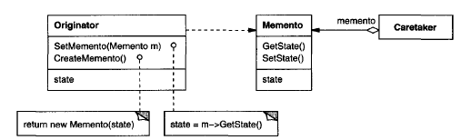

# **Memento Pattern** in **C\#**

## Overview

This project demonstrates the **Memento Pattern** using a practical example of **an editor that supports an undo mechanism**.

The **Memento Pattern** is a **behavioral** pattern that **captures and externalizes an object's internal state without violating encapsulation so the object can be restored to that state later**.

In this example, we have:

* **`Originator (Editor)`**: The object whose state needs to be saved. It creates a memento containing a snapshot of its current internal state and uses a memento to restore itself.
* **`Memento (EditorState)`**: An object that stores the internal state of the Originator. It has a narrow interface for the Caretaker (only for passing it around) and a wide interface for the Originator (to access all state data).
* **`Caretaker (HistoryManager)`**: The object responsible for the memento's safekeeping. It requests the memento from the Originator, holds it, and passes it back to the Originator for restoration, never operating on or examining its contents.

-----

## Structure

### Diagram



### 1\. Core Interface / Abstract Class

* **`EditorState` (Memento)**: A simple class (or interface in more complex implementations) that holds the Originator's state. It is **opaque** to the Caretaker, meaning the Caretaker can't inspect its contents.

### 2\. Concrete Implementations

* **`Editor` (Originator)**: Contains the actual state (`Content`) and methods to save (`CreateState()`) and restore (`Restore()`) its state using the `EditorState` object.

### 3\. Client

* **`HistoryManager` (Caretaker)**: Stores a collection of `EditorState` (mementos). It manages the undo/redo history without knowing what is inside the mementos.

-----

## Example Usage

```csharp
using System;
using System.Collections.Generic;

// 1. Memento (EditorState) - Stores the Originator's state
public class EditorState
{
    private readonly string _content;

    // Only the Originator should have access to this constructor
    public EditorState(string content)
    {
        _content = content;
    }

    // Wide interface for the Originator (accessible via a protected/internal
    // mechanism in real-world scenarios, but public for simplicity here)
    public string GetContent()
    {
        return _content;
    }
}

// 2. Originator (Editor) - The object whose state is being saved
public class Editor
{
    private string _content = "";

    public void Type(string text)
    {
        _content += text;
        Console.WriteLine($"Editor current content: '{_content}'");
    }

    // Creates a Memento (snapshot of the current state)
    public EditorState CreateState()
    {
        // Encapsulates the internal state
        return new EditorState(_content); 
    }

    // Restores the state from a Memento
    public void Restore(EditorState state)
    {
        // Only the Originator can access the state inside the Memento
        _content = state.GetContent(); 
    }

    public string GetContent()
    {
        return _content;
    }
}

// 3. Caretaker (HistoryManager) - Manages the Mementos
public class HistoryManager
{
    private readonly Stack<EditorState> _history = new Stack<EditorState>();

    // Caretaker only handles the Memento as an opaque object
    public void Save(EditorState state)
    {
        _history.Push(state);
        Console.WriteLine("--- State Saved ---");
    }

    public EditorState Undo()
    {
        if (_history.Count > 1) // Keep at least one state to ensure functionality
        {
            _history.Pop(); // Discard the current state
            Console.WriteLine("--- Undo Performed ---");
            return _history.Peek(); // Return the previous state
        }
        
        Console.WriteLine("--- Cannot Undo further ---");
        return _history.Peek(); // Return the oldest state
    }
}

public class Program
{
    public static void Main()
    {
        Editor editor = new Editor();
        HistoryManager history = new HistoryManager();

        // 1. Initial State
        editor.Type("Hello ");
        history.Save(editor.CreateState());

        // 2. State after first save
        editor.Type("World");
        history.Save(editor.CreateState());
        
        // 3. State after second save
        editor.Type("!");

        // Current state before undo
        Console.WriteLine($"\nFinal content before undo: '{editor.GetContent()}'");

        // Perform undo
        EditorState previousState = history.Undo();
        editor.Restore(previousState);
        Console.WriteLine($"Content after first undo: '{editor.GetContent()}'");

        // Perform second undo
        previousState = history.Undo();
        editor.Restore(previousState);
        Console.WriteLine($"Content after second undo: '{editor.GetContent()}'");
    }
}
```

### Output

```cmd
Editor current content: 'Hello '
--- State Saved ---
Editor current content: 'Hello World'
--- State Saved ---
Editor current content: 'Hello World!'

Final content before undo: 'Hello World!'
--- Undo Performed ---
Content after first undo: 'Hello World'
--- Undo Performed ---
Content after second undo: 'Hello '
```

-----

## Benefits

* **`Preserves Encapsulation`**: The pattern avoids exposing the Originator's internal, sensitive state to other objects (the Caretaker). Only the Originator can access the data within the Memento.
* **`Simplified Originator`**: The Originator doesn't have to manage the history or storage of its previous states; this burden is delegated to the Caretaker.
* **`Supports Undo/Redo Mechanisms`**: It provides a reliable way to implement features like undo, rollback, and checkpoints by capturing exact states.

-----

## Common Use Cases

* **Implementing Undo/Redo functionality**: This is the most common use case, allowing users to reverse operations.
* **Checkpoints and State Recovery**: Saving the state of complex objects (like game states or long transactions) to be able to recover from errors or continue later.
* **Iterators**: As shown in the motivation, a Memento can be used to hold the state of an iteration over a collection without exposing the collection's internal structure.
