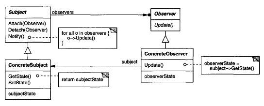

# **Observer Pattern** in **C\#**

## Overview

This project demonstrates the **Observer Pattern** using a practical example of **a digital clock (observers) being updated by a timer (subject)**.

The **Observer Pattern** is a **behavioral** pattern that **defines a one-to-many dependency so that multiple dependents (observers) are notified and updated automatically when one object (the subject) changes its state**.

In this example, we have:

* **`Subject (IObservable)`**: The interface for the object being observed (the `ClockTimer`), allowing observers to attach or detach.
* **`ConcreteSubject (ClockTimer)`**: Stores the time state and notifies its registered observers when the time changes.
* **`Observer (IObserver)`**: The interface defining the update method (`Update`) for objects that should be notified.
* **`ConcreteObserver (DigitalClock, AnalogClock)`**: Objects that implement the `IObserver` interface, maintaining a reference to the `ClockTimer` and updating their display when notified.

-----

## Structure

### Diagram



### 1\. Core Interface / Abstract Class

* **`IObserver<T>`**: Represents the interface for all observers. The single method `Update(T subject)` is called by the subject to notify the observer of a state change, passing the subject itself as an argument (Pull Model).
* **`IObservable<T>`**: Represents the interface for the subject. It defines methods for managing observers: `Attach(IObserver<T> observer)`, `Detach(IObserver<T> observer)`, and `NotifyObservers()`.

### 2\. Concrete Implementations

* **`ClockTimer`**: The **ConcreteSubject**. It inherits from `IObservable<ClockTimer>`, holds the current time state (Hour, Minute, Second), and has a `Tick()` method to simulate a time advancement and call `NotifyObservers()`.
* **`DigitalClock`**: A **ConcreteObserver**. It implements `IObserver<ClockTimer>` and displays the time in a digital format. Its `Update` method queries the `ClockTimer` for the new state and prints it.
* **`AnalogClock`**: Another **ConcreteObserver**. It implements `IObserver<ClockTimer>` and displays the time in an analog format.

### 3\. Client

* **`Program`**: The client code that creates the subject (`ClockTimer`) and multiple observers (`DigitalClock`, `AnalogClock`), attaches them to the subject, and then simulates the subject's state change (`timer.Tick()`).

-----

## Example Usage

```csharp
using System;
using System.Collections.Generic;

// 1. Core Interfaces
public interface IObserver<T>
{
    void Update(T subject);
}

public interface IObservable<T>
{
    void Attach(IObserver<T> observer);
    void Detach(IObserver<T> observer);
    void NotifyObservers();
}

// 2. Concrete Subject
public class ClockTimer : IObservable<ClockTimer>
{
    private List<IObserver<ClockTimer>> _observers = new List<IObserver<ClockTimer>>();
    private int _hour, _minute, _second;

    public int GetHour() => _hour;
    public int GetMinute() => _minute;
    public int GetSecond() => _second;

    public void Attach(IObserver<ClockTimer> observer)
    {
        _observers.Add(observer);
    }

    public void Detach(IObserver<ClockTimer> observer)
    {
        _observers.Remove(observer);
    }

    public void NotifyObservers()
    {
        foreach (var observer in _observers)
        {
            observer.Update(this);
        }
    }

    // Simulates the internal time update
    public void Tick()
    {
        // For simplicity, just advance the second and handle rollover
        _second++;
        if (_second >= 60)
        {
            _second = 0;
            _minute++;
            if (_minute >= 60)
            {
                _minute = 0;
                _hour = (_hour + 1) % 24;
            }
        }
        Console.WriteLine($"\n--- ClockTimer State Changed to: {_hour:D2}:{_minute:D2}:{_second:D2} ---");
        NotifyObservers();
    }
}

// 2. Concrete Observers
public class DigitalClock : IObserver<ClockTimer>
{
    private ClockTimer _subject;

    public DigitalClock(ClockTimer subject)
    {
        _subject = subject;
        _subject.Attach(this);
    }

    public void Update(ClockTimer subject)
    {
        if (subject == _subject) // Ensure we're only updating for the correct subject
        {
            int hour = subject.GetHour();
            int minute = subject.GetMinute();
            int second = subject.GetSecond();
            Console.WriteLine($"DigitalClock: {hour:D2}:{minute:D2}:{second:D2} (Updated)");
        }
    }
}

public class AnalogClock : IObserver<ClockTimer>
{
    private ClockTimer _subject;

    public AnalogClock(ClockTimer subject)
    {
        _subject = subject;
        _subject.Attach(this);
    }

    public void Update(ClockTimer subject)
    {
        if (subject == _subject)
        {
            int minute = subject.GetMinute();
            int second = subject.GetSecond();
            // In a real app, this would calculate and draw hands
            Console.WriteLine($"AnalogClock: Hands position updated. Minute Hand at {minute * 6} degrees.");
        }
    }
}

// 3. Client
public class Program
{
    public static void Main()
    {
        ClockTimer timer = new ClockTimer();

        // Create and attach observers
        DigitalClock digitalClock = new DigitalClock(timer);
        AnalogClock analogClock = new AnalogClock(timer);

        Console.WriteLine("Initial Setup Complete. Clocks are observing the Timer.");

        // Simulate state changes (ticks)
        timer.Tick();
        timer.Tick();
        
        // Detach one observer
        timer.Detach(analogClock);
        Console.WriteLine("\nAnalogClock detached.");

        // Simulate another state change
        timer.Tick();
    }
}
```

### Output

```cmd
Initial Setup Complete. Clocks are observing the Timer.

--- ClockTimer State Changed to: 00:00:01 ---
DigitalClock: 00:00:01 (Updated)
AnalogClock: Hands position updated. Minute Hand at 0 degrees.

--- ClockTimer State Changed to: 00:00:02 ---
DigitalClock: 00:00:02 (Updated)
AnalogClock: Hands position updated. Minute Hand at 0 degrees.

AnalogClock detached.

--- ClockTimer State Changed to: 00:00:03 ---
DigitalClock: 00:00:03 (Updated)
```

-----

## Benefits

* **Abstract Coupling between Subject and Observer**: The subject only knows about the generic `IObserver` interface, not the concrete observer classes (`DigitalClock`, `AnalogClock`). This keeps them loosely coupled, allowing them to vary and be reused independently.
* **Support for Broadcast Communication**: The subject doesn't need to know the number or specific types of observers; it simply broadcasts a notification to all subscribed objects. This makes it easy to add or remove new observers without modifying the subject.
* **Independent Variation and Reusability**: You can reuse the subject (`ClockTimer`) with different presentation objects, and reuse the observer types with different subjects (if designed with a more generic update protocol).

-----

## Common Use Cases

* **GUI Toolkits (Model-View-Controller/ViewModel)**: The **Model** (Subject/Application Data) notifies the **View** (Observer/Presentation Layer) when its state changes.
* **Event Handling Systems**: Where an event source (Subject) publishes an event, and multiple listeners (Observers) subscribe to handle it.
* **Stock Trading Applications**: A stock quote server (Subject) updates all interested clients (Observers) whenever a stock price changes.
* **Distributed Systems and Microservices**: Implementing a Publish-Subscribe (Pub/Sub) messaging system.
