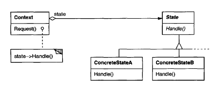

# **State Pattern** in **C\#**

## Overview

This project demonstrates the **State Pattern** using a practical example of a **TCP Connection's different states**.

The **State Pattern** is a **behavioral** pattern that **allows an object to alter its behavior when its internal state changes, making the object appear to change its class**.

In this example, we have:

* **`TCPConnection` (Context)**: Represents the network connection. It maintains a reference to the current state object. It delegates state-specific requests (like `Open`, `Close`, `Send`) to this state object.
* **`TCPState` (State)**: The abstract class that defines the interface for all concrete state implementations.
* **`TCPClosed`, `TCPEstablished`, `TCPListen` (ConcreteState)**: Subclasses that implement the behavior specific to each connection state and handle the logic for state transitions.

-----

## Structure

### Diagram



### 1\. Core Interface / Abstract Class

* **`TCPState`**: Defines the virtual/abstract methods for all operations that depend on the connection's state (e.g., `ActiveOpen`, `Close`, `Send`). It also includes a protected method, `ChangeState`, to transition the context to a new state.

### 2\. Concrete Implementations

* **`TCPClosed`**: Implements the behavior when the connection is closed. An `ActiveOpen` request from this state would transition it to `TCPEstablished`.
* **`TCPEstablished`**: Implements the behavior when the connection is established. A `Close` request from this state would transition it to `TCPListen` (simplified for this example).
* **`TCPListen`**: Implements the behavior when the connection is listening. A `Send` request (simplified as a valid action in this example) would transition it to `TCPEstablished`.
* *Note: These concrete state classes are often implemented as **Singletons** since they hold no instance-specific data and can be shared.*

### 3\. Context

* **`TCPConnection`**: Defines the public interface for the client and maintains a private reference (`_state`) to the current `TCPState` object. It delegates client requests to the current state object.

-----

## Example Usage

```c#
using System;

// 1. Abstract State Class (State)
public abstract class TCPState
{
    // Simplified: No data transmission object needed for this demo
    public virtual void ActiveOpen(TCPConnection t) { Console.WriteLine("Action not valid in this state."); }
    public virtual void PassiveOpen(TCPConnection t) { Console.WriteLine("Action not valid in this state."); }
    public virtual void Close(TCPConnection t) { Console.WriteLine("Action not valid in this state."); }
    public virtual void Send(TCPConnection t) { Console.WriteLine("Action not valid in this state."); }

    protected void ChangeState(TCPConnection t, TCPState s)
    {
        t.ChangeState(s);
    }
}

// 3. Concrete State Classes (ConcreteState) - Implemented as Singletons
public class TCPClosed : TCPState
{
    private static TCPClosed _instance;
    private TCPClosed() { }
    public static TCPClosed Instance()
    {
        if (_instance == null) _instance = new TCPClosed();
        return _instance;
    }

    public override void ActiveOpen(TCPConnection t)
    {
        Console.WriteLine("TCPConnection: Sending SYN, receiving SYN/ACK...");
        Console.WriteLine("TCPConnection state changed to Established.");
        ChangeState(t, TCPEstablished.Instance());
    }

    public override void PassiveOpen(TCPConnection t)
    {
        Console.WriteLine("TCPConnection: Entering passive listening mode.");
        Console.WriteLine("TCPConnection state changed to Listen.");
        ChangeState(t, TCPListen.Instance());
    }

    public override void Close(TCPConnection t)
    {
        Console.WriteLine("TCPConnection: Already closed.");
    }
}

public class TCPEstablished : TCPState
{
    private static TCPEstablished _instance;
    private TCPEstablished() { }
    public static TCPEstablished Instance()
    {
        if (_instance == null) _instance = new TCPEstablished();
        return _instance;
    }

    public override void Close(TCPConnection t)
    {
        Console.WriteLine("TCPConnection: Sending FIN, receiving ACK of FIN...");
        Console.WriteLine("TCPConnection state changed to Listen (waiting for final ACK/timeout).");
        ChangeState(t, TCPListen.Instance());
    }
    
    public override void Send(TCPConnection t)
    {
        Console.WriteLine("TCPConnection: Transmitting data octet stream.");
    }
}

public class TCPListen : TCPState
{
    private static TCPListen _instance;
    private TCPListen() { }
    public static TCPListen Instance()
    {
        if (_instance == null) _instance = new TCPListen();
        return _instance;
    }

    public override void Send(TCPConnection t)
    {
        // Typically, this would be a response to a SYN from a client
        Console.WriteLine("TCPConnection: Receiving SYN, sending SYN/ACK...");
        Console.WriteLine("TCPConnection state changed to Established.");
        ChangeState(t, TCPEstablished.Instance());
    }
}


// 2. Context Class (Context)
public class TCPConnection
{
    private TCPState _state;

    public TCPConnection()
    {
        // Initial state is Closed
        _state = TCPClosed.Instance();
        Console.WriteLine($"Initial State: {GetCurrentStateName()}");
    }

    // Friend-like access via public method for State objects to change state
    public void ChangeState(TCPState s)
    {
        _state = s;
        Console.WriteLine($"Current State: {GetCurrentStateName()}");
    }

    public string GetCurrentStateName()
    {
        return _state.GetType().Name;
    }

    // Client operations, delegated to the current state object
    public void ActiveOpen() { _state.ActiveOpen(this); }
    public void PassiveOpen() { _state.PassiveOpen(this); }
    public void Close() { _state.Close(this); }
    public void Send() { _state.Send(this); }
}

public class Program
{
    public static void Main()
    {
        TCPConnection connection = new TCPConnection();

        // 1. Initial State: Closed
        Console.WriteLine("\n--- Scenario 1: Active Open ---");
        connection.ActiveOpen(); // State: Closed -> Established
        connection.Send();       // State: Established (data transmission)
        connection.Close();      // State: Established -> Listen

        // 2. Behavior in Listen state
        Console.WriteLine("\n--- Scenario 2: Action in Listen ---");
        connection.Send();       // State: Listen -> Established (simulating a response to a client's request)

        // 3. Behavior in Established state
        Console.WriteLine("\n--- Scenario 3: Invalid Action ---");
        connection.PassiveOpen();// State: Established (Action not valid)
    }
}

```

### Output

```cmd
Initial State: TCPClosed

--- Scenario 1: Active Open ---
TCPConnection: Sending SYN, receiving SYN/ACK...
TCPConnection state changed to Established.
Current State: TCPEstablished
TCPConnection: Transmitting data octet stream.
TCPConnection: Sending FIN, receiving ACK of FIN...
TCPConnection state changed to Listen (waiting for final ACK/timeout).
Current State: TCPListen

--- Scenario 2: Action in Listen ---
TCPConnection: Receiving SYN, sending SYN/ACK...
TCPConnection state changed to Established.
Current State: TCPEstablished

--- Scenario 3: Invalid Action ---
Action not valid in this state.
```

-----

## Benefits

* **`Localizes State-Specific Behavior`**: The logic and behavior for a particular state are consolidated into a single class. This prevents monolithic conditional (`if/else` or `switch`) statements scattered across the Context class.
* **`Simplifies Context Class`**: The Context (`TCPConnection`) no longer needs to know the details of state-specific behavior or state transition logic, delegating that responsibility entirely to the State objects.
* **`Makes State Transitions Explicit`**: State changes are explicitly represented by substituting the Context's State object, rather than just changing an internal data variable.
* **`Easily Extensible`**: Adding a new state (e.g., `TCPTimeWait`) only requires creating a new `ConcreteState` subclass without modifying existing state classes or the Context class (adhering to the Open/Closed Principle).

-----

## Common Use Cases

* **Finite State Machines (FSM)**: Where an object's behavior changes dramatically based on its current condition, such as network protocols (like TCP).
* **User Interface Tools/Modes**: In a drawing program, changing tools (e.g., from 'Draw Line' to 'Select' or 'Erase') changes the application's response to mouse clicks and movements.
* **Workflow or Document States**: Managing the lifecycle of an object like an `Order` (e.g., `Pending`, `Processing`, `Shipped`, `Delivered`).
* **Game Programming**: Defining the behavior of a character or entity (e.g., `Idle`, `Walking`, `Attacking`).
