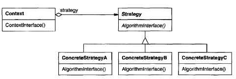

# **Strategy Pattern** in **C\#**

## Overview

This project demonstrates the **Strategy Pattern** using a practical example of **encapsulating different line-breaking algorithms**.

The **Strategy Pattern** is a **behavioral** pattern that **defines a family of algorithms, encapsulates each one, and makes them interchangeable**.

In this example, we have:

* **`ICompositor`**: Declares the interface for all line-breaking algorithms (Strategies).
* **`SimpleCompositor`, `TeXCompositor`, `ArrayCompositor`**: Concrete implementations of the line-breaking algorithms (Concrete Strategies).
* **`Composition`**: The class that uses a line-breaking algorithm (Context). It maintains a reference to an `ICompositor` object.

-----

## Structure

### Diagram



### 1\. Core Interface / Abstract Class

* **`ICompositor` (Strategy)**: Declares the interface for the line-breaking algorithm.

    ```csharp
    public interface ICompositor
    {
        void Compose(string text);
    }
    ```

### 2\. Concrete Implementations

* **`SimpleCompositor` (ConcreteStrategy)**: Implements a simple line-breaking strategy (e.g., breaking one line at a time).

    ```csharp
    public class SimpleCompositor : ICompositor
    {
        public void Compose(string text)
        {
            Console.WriteLine($"Using SimpleCompositor: Breaking text '{text}' one line at a time.");
        }
    }
    ```

* **`TeXCompositor` (ConcreteStrategy)**: Implements a global line-breaking strategy (e.g., optimizing breaks for an entire paragraph).

    ```csharp
    public class TeXCompositor : ICompositor
    {
        public void Compose(string text)
        {
            Console.WriteLine($"Using TeXCompositor: Globally optimizing line breaks for text '{text}'.");
        }
    }
    ```

* **`ArrayCompositor` (ConcreteStrategy)**: Implements a fixed-interval line-breaking strategy (e.g., breaking every *N* items).

    ```csharp
    public class ArrayCompositor : ICompositor
    {
        private readonly int _interval;
        public ArrayCompositor(int interval) => _interval = interval;
        public void Compose(string text)
        {
            Console.WriteLine($"Using ArrayCompositor (Interval: {_interval}): Breaking text '{text}' into fixed rows.");
        }
    }
    ```

### 3\. Client

* **`Composition` (Context)**: Configured with a `ICompositor` object. It delegates the `Repair` responsibility to its current `ICompositor`.

    ```csharp
    public class Composition
    {
        private ICompositor _compositor;
        private string _text;

        public Composition(ICompositor compositor, string text)
        {
            _compositor = compositor;
            _text = text;
        }

        public void SetCompositor(ICompositor newCompositor)
        {
            Console.WriteLine("--- Switching Compositor Strategy ---");
            _compositor = newCompositor;
        }

        public void Repair()
        {
            // The Context delegates the algorithm execution to the Strategy object
            Console.WriteLine($"\nRepairing Composition for text: '{_text}'");
            _compositor.Compose(_text);
            Console.WriteLine("Composition repair complete.");
        }
    }
    ```

-----

## Example Usage

```csharp
// Example code showing how the pattern is used in practice
// Create the text to be composed
string documentText = "The quick brown fox jumps over the lazy dog.";

// 1. Instantiate the Context with the first strategy (SimpleCompositor)
ICompositor simple = new SimpleCompositor();
Composition document = new Composition(simple, documentText);

// Use the initial strategy
document.Repair();

// 2. Change the strategy dynamically at run-time (TeXCompositor)
ICompositor teX = new TeXCompositor();
document.SetCompositor(teX);

// Use the new strategy
document.Repair();

// 3. Change the strategy again (ArrayCompositor)
ICompositor array = new ArrayCompositor(10);
document.SetCompositor(array);

// Use the final strategy
document.Repair();
```

### Output

```cmd
Repairing Composition for text: 'The quick brown fox jumps over the lazy dog.'
Using SimpleCompositor: Breaking text 'The quick brown fox jumps over the lazy dog.' one line at a time.
Composition repair complete.
--- Switching Compositor Strategy ---

Repairing Composition for text: 'The quick brown fox jumps over the lazy dog.'
Using TeXCompositor: Globally optimizing line breaks for text 'The quick brown fox jumps over the lazy dog.'.
Composition repair complete.
--- Switching Compositor Strategy ---

Repairing Composition for text: 'The quick brown fox jumps over the lazy dog.'
Using ArrayCompositor (Interval: 10): Breaking text 'The quick brown fox jumps over the lazy dog.' into fixed rows.
Composition repair complete.
```

-----

## Benefits

* **Families of related algorithms**: Strategy classes define a **reusable family of behaviors** for contexts, with common functionality potentially factored out using inheritance.
* **Alternative to subclassing**: It lets you **vary the algorithm independently of its context**, avoiding the hard-wiring of behavior into the `Context` class which happens with direct subclassing.
* **Eliminates conditional statements**: It replaces numerous `if`/`else` or `switch` statements used to select behavior with **simple delegation** to a Strategy object, leading to cleaner code.
* **Dynamic change**: The algorithm used by the Context can be **switched at run-time**, as demonstrated by the `SetCompositor` method.

-----

## Common Use Cases

* **Payment Gateways**: A shopping cart can use a `PaymentStrategy` for Credit Card, PayPal, or Crypto payments.
* **Data Compression/Encryption**: A file utility can use different compression algorithms (ZIP, GZIP) or encryption algorithms (AES, DES) as concrete strategies.
* **Validation Rules**: A form field can use different `ValidationStrategy` objects to enforce constraints like `RangeValidator` or `RegexValidator`.
* **Sorting Algorithms**: Different sorting methods (Quicksort, MergeSort, BubbleSort) can be implemented as interchangeable `SortStrategy` objects.
