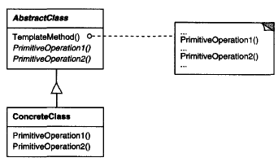

# **Template Method** in **C#**

## Overview

This project demonstrates the **Template Method** design pattern using a practical example of **defining a report generation workflow**.

The **Template Method** is a **behavioral** pattern that **defines the skeleton of an algorithm in an operation, deferring some steps to subclasses, allowing them to redefine certain steps without changing the algorithm's structure**.

In this example, we have:

* **`ReportGenerator` (AbstractClass)**: Defines the invariant sequence of steps (the template method) for generating a report and declares abstract/virtual methods for the steps that vary.
* **`PDFReportGenerator` / `ExcelReportGenerator` (ConcreteClass)**: Implements the specific steps (e.g., fetching data, formatting output) required to produce the report in a particular format.

---

## Structure

### Diagram



### 1. Core Interface / Abstract Class

* **`ReportGenerator` (AbstractClass)**:
  * It contains the **Template Method**, `GenerateReport()`, which is a concrete method that defines the fixed sequence of the report generation algorithm.
  * It defines **abstract primitive operations** like `FetchData()` and `FormatDocument()` that *must* be implemented by subclasses.
  * It may define **hook operations** like `PreProcessData()` (a `virtual` method with an empty body) that subclasses *may* override to add specific behavior at extension points.

### 2. Concrete Implementations

* **`PDFReportGenerator` (ConcreteClass)**: Implements `FetchData()` and `FormatDocument()` to specifically work with PDF-related data and formatting.
* **`ExcelReportGenerator` (ConcreteClass)**: Implements `FetchData()` and `FormatDocument()` to work with data suitable for an Excel spreadsheet.

### 3. Client

* **`Client`**: Creates an instance of a specific concrete report generator (e.g., `PDFReportGenerator`) and calls the invariant `GenerateReport()` template method.

### 4. Primitive Operations

Primitive operations are the steps that **must** be implemented by the subclasses to complete the algorithm. They are typically declared as `abstract`.

---

## Example Usage

```csharp
// Abstract Class: Defines the Template Method and abstract/hook operations
abstract class ReportGenerator
{
    // The Template Method: Defines the fixed algorithm skeleton.
    public void GenerateReport()
    {
        Console.WriteLine("--- Starting Report Generation ---");
        // 1. Hook operation (optional step)
        PreProcessData(); 
        
        // 2. Abstract primitive operation (mandatory step)
        string data = FetchData(); 
        
        // 3. Concrete operation (invariant step)
        SortData(ref data); 
        
        // 4. Abstract primitive operation (mandatory step)
        FormatDocument(data); 
        
        Console.WriteLine("--- Report Generation Finished ---\n");
    }

    // Abstract methods: MUST be implemented by subclasses (Primitive Operations)
    protected abstract string FetchData();
    protected abstract void FormatDocument(string data);

    // Virtual method: CAN be overridden by subclasses (Hook Operation)
    protected virtual void PreProcessData() 
    {
        // Default implementation does nothing
    }

    // Concrete method: Implemented in the base class (Invariant Step)
    private void SortData(ref string data)
    {
        Console.WriteLine("Step: Sorting data in a standard way.");
        data += " (SORTED)";
    }
}

// Concrete Class 1: Implements the steps for a PDF Report
class PDFReportGenerator : ReportGenerator
{
    protected override string FetchData()
    {
        Console.WriteLine("Step: Fetching data from database for PDF.");
        return "Customer Data for PDF";
    }

    protected override void FormatDocument(string data)
    {
        Console.WriteLine($"Step: Formatting '{data}' into a PDF layout.");
    }
    
    // Override the hook operation to add specific behavior
    protected override void PreProcessData()
    {
        Console.WriteLine("Hook: Setting up special PDF headers and footers.");
    }
}

// Concrete Class 2: Implements the steps for an Excel Report
class ExcelReportGenerator : ReportGenerator
{
    protected override string FetchData()
    {
        Console.WriteLine("Step: Fetching data from an API for Excel.");
        return "Financial Data for Excel";
    }

    protected override void FormatDocument(string data)
    {
        Console.WriteLine($"Step: Exporting '{data}' into an Excel spreadsheet.");
    }
    
    // This subclass chooses NOT to override the PreProcessData hook.
}

// Client Code
public class Client
{
    public static void Main(string[] args)
    {
        Console.WriteLine("Generating PDF Report:");
        ReportGenerator pdfReport = new PDFReportGenerator();
        pdfReport.GenerateReport();

        Console.WriteLine("Generating Excel Report:");
        ReportGenerator excelReport = new ExcelReportGenerator();
        excelReport.GenerateReport();
    }
}
````

### Output

```cmd
Generating PDF Report:
--- Starting Report Generation ---
Hook: Setting up special PDF headers and footers.
Step: Fetching data from database for PDF.
Step: Sorting data in a standard way.
Step: Formatting 'Customer Data for PDF (SORTED)' into a PDF layout.
--- Report Generation Finished ---

Generating Excel Report:
--- Starting Report Generation ---
Step: Fetching data from an API for Excel.
Step: Sorting data in a standard way.
Step: Exporting 'Financial Data for Excel (SORTED)' into an Excel spreadsheet.
--- Report Generation Finished ---
```

---

## Benefits

* **`Invert Control Structure ("Hollywood Principle")`**: The base class dictates the flow (the 'when') and calls the subclass methods, meaning "Don't call us, we'll call you." This keeps the overall algorithm consistent.
* **`Code Reuse and Invariant Algorithm`**: The template method (`GenerateReport` in the example) implements the invariant parts of the algorithm once, preventing duplication and ensuring that the fundamental process structure cannot be accidentally changed by subclasses.
* **`Controlled Customization`**: Subclasses can only vary the steps that are explicitly designated as primitive (`abstract`) or hook (`virtual`) operations, giving the designer control over the extension points.

---

## Common Use Cases

* **`Application Frameworks`**: Foundational in frameworks where the base class dictates the life cycle of an object (e.g., application startup/shutdown, window drawing) but leaves the specific implementation details to the user-defined subclasses.
* **`Data Processing/Workflow`**: Implementing a standard sequence of steps for processing data (e.g., read, transform, validate, write) where the 'read' and 'write' steps vary based on the data source/sink (e.g., database, file, API).
* **`Unit Testing`**: Often used in testing frameworks to define the `SetUp()`, `RunTest()`, and `TearDown()` sequence, where subclasses only implement the `RunTest()` step.
