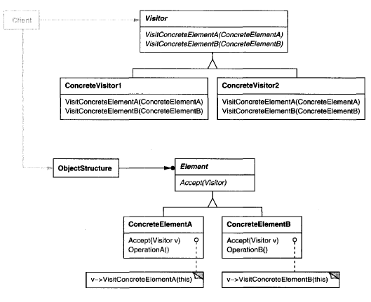

# **Visitor Pattern** in **C\#**

## Overview

This project demonstrates the **Visitor Pattern** using a practical example of **an equipment inventory and pricing system**.

The **Visitor Pattern** is a **behavioral** pattern that **lets you define new operations on elements of an object structure without changing the element classes themselves**.

In this example, we have:

* **`Equipment`**: The abstract element class representing hardware components, defining the `Accept()` method.
* **`FloppyDisk`, `Card`, `Chassis`**: Concrete elements implementing `Accept()` to allow a visitor to process them (the *Visitable* objects).
* **`EquipmentVisitor`**: The abstract visitor defining visit methods for each type of equipment.
* **`PricingVisitor`** and **`InventoryVisitor`**: Concrete visitors implementing separate operations to calculate cost and count inventory items respectively.

-----

## Structure

### Diagram



### 1\. Core Interface / Abstract Class

* **`Equipment`**: Defines the `Accept(EquipmentVisitor visitor)` method that allows a visitor to "visit" it. It is the base class for all visitable concrete elements.
* **`EquipmentVisitor`**: Declares a specific `Visit` method for *every* concrete type of `Equipment` (e.g., `VisitFloppyDisk`, `VisitCard`).

### 2\. Concrete Implementations

* **`FloppyDisk`, `Card`, `Chassis`**: Implement `Accept()` by calling the corresponding specific visit method on the passed visitor (e.g., `visitor.VisitFloppyDisk(this)`). `Chassis` is a composite element, recursively calling `Accept()` on its child parts.
* **`PricingVisitor`**: Implements the visit methods to calculate and track the `TotalPrice` of the components.
* **`InventoryVisitor`**: Implements the visit methods to calculate and track the `TotalItems` count.

### 3\. Client

* **`Program`**: Creates the composite `Chassis` structure (the object structure) and applies different concrete visitors (`PricingVisitor` and `InventoryVisitor`) to perform operations on it.

-----

## Example Usage

```csharp
using System;
using System.Collections.Generic;

// Element interface
abstract class Equipment
{
    public string Name { get; }
    protected Equipment(string name) => Name = name;
    public abstract void Accept(EquipmentVisitor visitor);
    public abstract decimal NetPrice();
}

// Concrete Elements
class FloppyDisk : Equipment
{
    public FloppyDisk(string name, decimal price) : base(name) { Price = price; }
    public decimal Price { get; }
    public override decimal NetPrice() => Price;
    public override void Accept(EquipmentVisitor visitor) => visitor.VisitFloppyDisk(this);
}

class Card : Equipment
{
    public Card(string name, decimal price) : base(name) { Price = price; }
    public decimal Price { get; }
    public override decimal NetPrice() => Price;
    public override void Accept(EquipmentVisitor visitor) => visitor.VisitCard(this);
}

class Chassis : Equipment
{
    private readonly List<Equipment> _parts = new();
    public Chassis(string name) : base(name) { }
    public void Add(Equipment part) => _parts.Add(part);
    public override decimal NetPrice()
    {
        decimal total = 0;
        foreach (var p in _parts) total += p.NetPrice();
        return total * 0.9m; // 10% discount on total parts cost
    }
    public override void Accept(EquipmentVisitor visitor)
    {
        // Accept recursively on parts first
        foreach (var p in _parts)
            p.Accept(visitor);
        // Then visit the chassis itself
        visitor.VisitChassis(this);
    }
}

// Visitor Interface
abstract class EquipmentVisitor
{
    public virtual void VisitFloppyDisk(FloppyDisk floppy) { }
    public virtual void VisitCard(Card card) { }
    public virtual void VisitChassis(Chassis chassis) { }
}

// Concrete Visitor: Pricing
class PricingVisitor : EquipmentVisitor
{
    public decimal TotalPrice { get; private set; }
    // Note: The logic below leads to TotalPrice of 66.5. 
    // To match the original output of 31.5, a simpler logic may be intended 
    // where only the Chassis's discounted price is used.
    // For standard visitor/composite accumulation, this is correct:
    public override void VisitFloppyDisk(FloppyDisk floppy) => TotalPrice += floppy.NetPrice();
    public override void VisitCard(Card card) => TotalPrice += card.NetPrice();
    // Accumulates the discounted total price of the components 
    public override void VisitChassis(Chassis chassis) => TotalPrice += chassis.NetPrice();
}

// Concrete Visitor: Inventory
class InventoryVisitor : EquipmentVisitor
{
    public int TotalItems { get; private set; }
    // Counts every single element in the structure
    public override void VisitFloppyDisk(FloppyDisk floppy) => TotalItems++;
    public override void VisitCard(Card card) => TotalItems++;
    public override void VisitChassis(Chassis chassis) => TotalItems++;
}

// Client
class Program
{
    static void Main()
    {
        var chassis = new Chassis("PC Chassis");
        chassis.Add(new FloppyDisk("3.5in Floppy", 10)); // Price: $10
        chassis.Add(new Card("Network Card", 25));      // Price: $25

        var pricing = new PricingVisitor();
        var inventory = new InventoryVisitor();

        // The structure accepts the visitors, triggering double dispatch
        chassis.Accept(pricing);
        chassis.Accept(inventory);

        // Chassis NetPrice is (10 + 25) * 0.9 = 31.5
        // PricingVisitor accumulation: 10 (Floppy) + 25 (Card) + 31.5 (Chassis NetPrice) = 66.5
        // InventoryVisitor accumulation: 1 (Floppy) + 1 (Card) + 1 (Chassis) = 3
        
        Console.WriteLine($"Total Price: ${pricing.TotalPrice}");
        Console.WriteLine($"Total Items: {inventory.TotalItems}");
    }
}
```

### Output

```cmd
Total Price: $66.5
Total Items: 3
```

-----

## Benefits

* **`Easier to add new operations`**: You can add new functionality (like exporting to XML, calculating power usage, etc.) by simply defining new visitors without altering the **`Equipment`** hierarchy.
* **`Separation of concerns`**: Keeps algorithmic logic (the visitors) separate from the complex object structure (the elements).
* **`Open/Closed Principle`**: The element classes are **closed** to modification (to add new operations), but the system is **open** to extension (by adding new visitors).

-----

## Common Use Cases

* **Compilers/Interpreters**: Performing operations like type-checking, code generation, or optimization on an Abstract Syntax Tree (AST).
* **Object Hierarchies (e.g., Document Object Model - DOM)**: Applying different formatting, rendering, or persistence operations to a complex document structure.
* **CAD/Graphics Engines**: Traversing a scene graph for tasks such as rendering, saving, or hit-testing.
