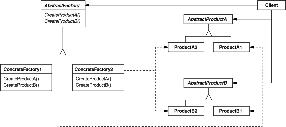

# Abstract Factory Design Pattern in C\#

## Overview

This project demonstrates the **Abstract Factory** design pattern using a simple **UI theme selector** example.

The Abstract Factory pattern provides an interface for creating families of related or dependent objects without specifying their concrete classes.

In this example, we have:

* **Products** → `Button`, `TextBox`
* **Factories** → `LightThemeFactory`, `DarkThemeFactory`
* **Client** → `UI` class that uses the factory to create and render UI components.

---

## Structure

### Diagram



### 1. Abstract Products

* `IButton` → Defines the interface for buttons.
* `ITextBox` → Defines the interface for text boxes.

### 2. Concrete Products

* `LightButton`, `LightTextBox` → Implement the UI components for **Light Theme**.
* `DarkButton`, `DarkTextBox` → Implement the UI components for **Dark Theme**.

### 3. Abstract Factory

* `IThemeFactory` → Declares methods to create abstract products (`CreateButton()`, `CreateTextBox()`).

### 4. Concrete Factories

* `LightThemeFactory` → Creates **Light** themed components.
* `DarkThemeFactory` → Creates **Dark** themed components.

### 5. Client

* `UI` → Uses the factory to create and render buttons and text boxes without knowing their concrete implementation.

---

## Example Usage

```csharp
IThemeFactory themeFactory;

// Suppose user selected "Dark Theme"
themeFactory = new DarkThemeFactory();
var ui = new UI(themeFactory);
ui.Render();

// Switch to Light Theme
themeFactory = new LightThemeFactory();
ui = new UI(themeFactory);
ui.Render();
```

### Output:

```
Rendering Dark Button
Rendering Dark TextBox
Rendering Light Button
Rendering Light TextBox
```

---

## Benefits of Abstract Factory

* **Encapsulation of object creation** → Clients don’t need to know which concrete class is being used.
* **Consistency across products** → Ensures UI components follow the same theme.
* **Flexibility** → Easily extendable for new themes (e.g., `HighContrastThemeFactory`).

---

## Use Cases

* GUI libraries (Light/Dark themes, OS-specific widgets).
* Cross-platform systems (Windows/Mac/Linux factories).
* Product families where consistency is required across multiple components.
