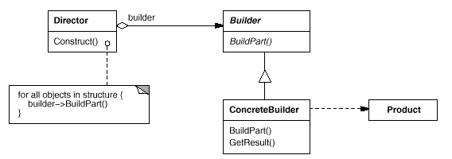

# Builder Design Pattern in C\#

## Overview

This project demonstrates the **Builder** design pattern using a **text conversion example**.

The Builder pattern separates the construction of a complex object from its representation, allowing the same construction process to create different representations.

In this example:

* **Director** → `RTFReader` controls the conversion process.
* **Builder** → `TextConverter` defines the interface for converting text.
* **Concrete Builders** → `ASCIIConverter`, `TeXConverter`, `TextWidgetConverter` produce different representations of the same text.

---

## Structure

### Diagram



### 1. Builder Interface

* `TextConverter` → Abstract class defining methods for building parts of a product:

  * `ConvertText(string text)`
  * `ConvertBold(string text)`
  * `ConvertItalic(string text)`
  * `GetResult()` → returns the final converted object.

### 2. Concrete Builders

* `ASCIIConverter` → Produces plain ASCII text (ignores formatting).
* `TeXConverter` → Produces LaTeX-formatted text (`\textbf{}`, `\textit{}`).
* `TextWidgetConverter` → Produces a structured list of text widgets with styles.

### 3. Director

* `RTFReader` → Reads tokens from an RTF-like document and uses a `TextConverter` to build the desired representation.

### 4. Client

* Creates an `RTFReader` with a specific converter and parses a document to get the desired output.

---

## Example Usage

```csharp
var rtfDocument = new List<(string, string)>
{
    ("text", "Hello "),
    ("bold", "World"),
    ("italic", "!")
};

// Convert to plain ASCII
var asciiReader = new RTFReader(new ASCIIConverter());
var asciiText = asciiReader.Parse(rtfDocument);
Console.WriteLine("ASCII: " + asciiText);

// Convert to TeX
var texReader = new RTFReader(new TeXConverter());
var texText = texReader.Parse(rtfDocument);
Console.WriteLine("TeX: " + texText);

// Convert to TextWidget
var widgetReader = new RTFReader(new TextWidgetConverter());
var widgets = widgetReader.Parse(rtfDocument);
Console.WriteLine("TextWidget:");
foreach (var widget in (List<Dictionary<string, string>>)widgets)
{
    Console.WriteLine(string.Join(", ", widget));
}
```

### Output:

```
ASCII: Hello World!
TeX: Hello \textbf{World}\textit{!}
TextWidget:
[type, label], [text, Hello ]
[type, label], [text, World], [style, bold]
[type, label], [text, !], [style, italic]
```

---

## Benefits of Builder Pattern

* **Separation of construction and representation** → Same process can produce multiple outputs.
* **Flexibility** → Easily add new converters without changing the director.
* **Readable construction process** → Complex object construction is simplified.

---

## Use Cases

* Document conversion (RTF → ASCII, LaTeX, HTML, GUI widgets).
* Complex object creation with multiple representations.
* GUI or report generators where the same content can be displayed differently.
