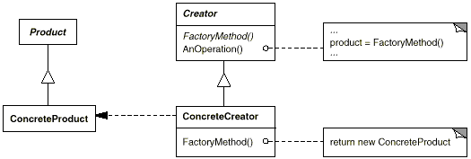

# Factory Method Design Pattern in C\#

## Overview

This project demonstrates the **Factory Method** design pattern using a simple **document creation** example.

The Factory Method pattern defines an interface for creating an object but allows subclasses to alter the type of objects that will be created. It lets a class defer instantiation to its subclasses.

In this example:

* **Product** → `Document` (abstract base class for all documents).
* **Concrete Products** → `DrawingDocument`, `TextDocument`.
* **Creator** → `Application` (abstract class with `CreateDocument` factory method).
* **Concrete Creators** → `DrawingApplication`, `TextApplication`.
* **Client** → Uses `Application` to create documents without knowing the concrete classes.

---

## Structure

### Diagram



### 1. Abstract Product

* `Document` → Declares common operations for documents (`Open`, `Save`).

### 2. Concrete Products

* `DrawingDocument` → Implements `Document` for drawing files.
* `TextDocument` → Implements `Document` for text files.

### 3. Abstract Creator

* `Application` → Declares the factory method `CreateDocument()` and contains logic (`NewDocument`) that uses the product.

### 4. Concrete Creators

* `DrawingApplication` → Overrides `CreateDocument` to produce `DrawingDocument`.
* `TextApplication` → Overrides `CreateDocument` to produce `TextDocument`.

### 5. Client

* Instantiates a specific `Application` (concrete creator) and calls `NewDocument()` to create and open a document.

---

## Example Usage

```csharp
Application app;

// Using DrawingApplication
app = new DrawingApplication();
app.NewDocument();

Console.WriteLine();

// Using TextApplication
app = new TextApplication();
app.NewDocument();
```

### Output:

```
Opening a drawing document.
Document created through Factory Method.

Opening a text document.
Document created through Factory Method.
```

---

## Benefits of Factory Method

* **Encapsulation of object creation** → Clients don’t need to know the exact class being instantiated.
* **Extensibility** → Easily add new document types without modifying existing code.
* **Single Responsibility** → Separates the document creation logic from its usage.

---

## Use Cases

* Document editors that support multiple file types.
* GUI frameworks that need platform-specific components.
* Situations where a class cannot anticipate the type of objects it must create.
