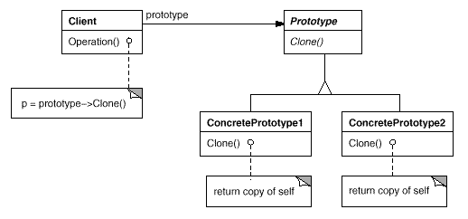

# Prototype Pattern in C\#

## Overview

This project demonstrates the **Prototype Pattern** using a simple **object cloning example**.

The Prototype pattern **allows creating new objects by copying existing ones rather than instantiating from scratch**. It lets a class **produce objects without knowing their concrete types**, which is useful when object creation is costly or complex.

In this example:

* **Prototype Interface** → `IPrototype` (declares the `Clone()` method).
* **Concrete Prototypes** → `ConcretePrototype1`, `ConcretePrototype2`.
* **Client** → Uses prototypes to create copies without knowing their exact types.

---

## Structure

### Diagram



### 1. Prototype Interface

* `IPrototype` → Declares a `Clone()` method to be implemented by concrete prototypes.

### 2. Concrete Prototypes

* `ConcretePrototype1` → Implements `IPrototype` for a simple object with `Name` and `Value`.
* `ConcretePrototype2` → Implements `IPrototype` for an object with `Description` and `CreatedDate`.

### 3. Client

* `Client` → Instantiates concrete prototypes and clones them. Modifies clones to demonstrate that originals remain unchanged.

---

## Example Usage

```csharp
var prototype1 = new ConcretePrototype1("Original", 100);
var clone1 = prototype1.Clone() as ConcretePrototype1;
clone1.Name = "Cloned";
clone1.Value = 200;

Console.WriteLine("Original Prototype 1: " + prototype1);
Console.WriteLine("Cloned Prototype 1: " + clone1);
```

### Output:

```
Original Prototype 1: ConcretePrototype1: Name=Original, Value=100
Cloned Prototype 1: ConcretePrototype1: Name=Cloned, Value=200
```

---

## Benefits of Prototype Pattern

* **Efficient Object Creation** → Cloning avoids the overhead of creating complex objects from scratch.
* **Flexibility** → New objects can be created at runtime without tight coupling to specific classes.
* **Preserves Object State** → Copies maintain the same properties as the original object, allowing modifications without affecting the source.

---

## Use Cases

* Creating objects in **performance-critical applications** where instantiation is expensive.
* Implementing **undo/redo functionality** by storing object snapshots.
* Duplicating objects in **graphical editors or simulation systems** where many similar objects exist.
