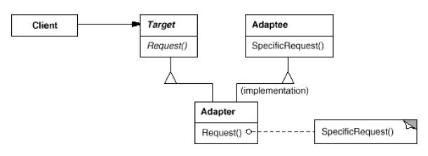

# Adapter Design Pattern in C#

## Overview
This project demonstrates the **Adapter** design pattern using a **drawing editor** example. The Adapter pattern allows incompatible interfaces to work together by converting the interface of one class (the adaptee) into an interface expected by the client (the target). In this example, we adapt a `TextView` class, which has its own interface for displaying and editing text, to work with a `DrawingEditor` that expects objects conforming to the `IShape` interface.

In this example, we have:
- **Target** → `IShape` interface, defining the expected interface for shapes in the drawing editor.
- **Adaptee** → `TextView`, an existing class with an incompatible interface for text display and editing.
- **Adapter** → `TextShape`, which adapts `TextView` to the `IShape` interface.
- **Client** → `DrawingEditor`, which interacts with shapes via the `IShape` interface.

---

## Structure

### Diagram


### 1. Target
- `IShape` → Defines the domain-specific interface that the client (`DrawingEditor`) uses. It includes methods like `BoundingBox` to get the shape's dimensions and `CreateManipulator` to support interactive manipulation.

### 2. Adaptee
- `TextView` → An existing class with an incompatible interface, providing methods like `GetOrigin` and `GetExtent` for text rendering, and `IsEmpty` to check if the text is empty.

### 3. Adapter
- `TextShape` → Adapts the `TextView` interface to the `IShape` interface using object composition. It holds a reference to a `TextView` instance and translates `IShape` method calls into `TextView` operations.

### 4. Client
- `DrawingEditor` → Interacts with objects that implement the `IShape` interface, unaware of whether they are native shapes or adapted objects like `TextShape`.

### 5. Additional Components
- `Manipulator` → An abstract class for objects that handle interactive manipulation (e.g., dragging a shape).
- `TextManipulator` → A concrete manipulator for `TextShape`, providing the functionality required by the `IShape` interface that `TextView` lacks.

---

## Example Usage
```csharp
// Create the adaptee
TextView textView = new TextView();

// Adapt it to IShape using the adapter
IShape textShape = new TextShape(textView);

// Use in client (DrawingEditor)
DrawingEditor editor = new DrawingEditor();
editor.AddShape(textShape);

// Demonstrate additional method (IsEmpty)
if (textShape is TextShape ts)
{
    Console.WriteLine($"Is the text shape empty? {ts.IsEmpty()}");
}
```

### Output:
```
Added shape with bounding box: BottomLeft (10, 20), TopRight (210, 70)
Created manipulator of type: TextManipulator
Is the text shape empty? False
```

---

## Benefits of Adapter
- **Reusability** → Enables reuse of existing classes (`TextView`) in systems expecting a different interface (`IShape`) without modifying their code.
- **Flexibility** → The object adapter allows a single `TextShape` to work with `TextView` and its subclasses, if any, by passing different instances to the adapter.
- **Separation of Concerns** → The adapter encapsulates the logic for interface conversion, keeping the client code clean and focused on its domain.
- **Extensibility** → Additional functionality (e.g., `CreateManipulator`) can be added to the adapter without altering the adaptee.

---

## Use Cases
- Integrating legacy code or third-party libraries with incompatible interfaces into a new system.
- Adapting UI components (e.g., adapting a text widget to work in a graphical editor).
- Enabling cross-system compatibility (e.g., adapting a data structure to a different API).
- Situations where you need to provide additional functionality to an existing class without modifying it.

---

## Implementation Notes
- **Object Adapter vs. Class Adapter**:
  - This example uses an **object adapter** (via composition), where `TextShape` holds a reference to a `TextView` instance. This approach is more flexible as it allows adapting `TextView` and its subclasses without modifying their code.
  - A **class adapter** would use multiple inheritance (not directly supported in C#), inheriting from both `IShape` and `TextView`. This is less flexible but avoids the need for an extra object reference.
- **Pluggable Adapters**: The adapter could be made more reusable by parameterizing it with delegates or configuration to handle different adaptee interfaces dynamically (e.g., for different types of text views).
- **Transparency**: The adapter is not fully transparent to clients expecting a `TextView` interface, as it exposes only the `IShape` interface. A two-way adapter could be implemented (using interfaces or multiple inheritance in languages that support it) to allow the object to be used as both a `TextView` and an `IShape`.
- **Amount of Adaptation**: The `TextShape` adapter performs both interface conversion (translating `BoundingBox` to `GetOrigin` and `GetExtent`) and adds new functionality (`CreateManipulator`) that `TextView` does not provide.
