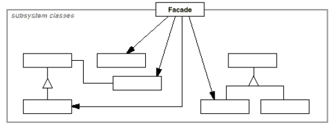

# **Facade Pattern** in **C#**

## Overview

This project demonstrates the **Facade Pattern** using a practical example of a **compiler subsystem** that converts source code into bytecode.

The **Facade Pattern** is a **structural** pattern that **provides a simplified, unified interface to a complex subsystem while allowing access to its components when needed**.

In this example, we have:

*   **`Client`**: The part of the system that compiles source code.
*   **`Compiler` (Facade)**: Provides a simple interface to the underlying compiler subsystem.
*   **Subsystem Classes**: `Scanner`, `Parser`, `ProgramNodeBuilder`, `ProgramNode`, `CodeGenerator`.
*   **Concrete Code Generators**: `RiscCodeGenerator`, `StackMachineCodeGenerator`.

---

## Structure

### Diagram



### 1. Facade Class

*   **`Compiler`**: Offers a single `Compile()` method that coordinates scanning, parsing, building the parse tree, and generating bytecode.

### 2. Subsystem Classes

*   **`Scanner`**: Converts input text into tokens.
*   **`Parser`**: Uses a `ProgramNodeBuilder` to construct a parse tree.
*   **`ProgramNode`**: Represents nodes in the parse tree, e.g., `StatementNode`, `ExpressionNode`.
*   **`CodeGenerator`**: Abstract base for generating bytecode.
*   **Concrete Code Generators**: `RiscCodeGenerator`, `StackMachineCodeGenerator` provide platform-specific implementations.

### 3. Client

*   **`Program`**: The client interacts with the compiler through the `Compiler` facade, unaware of the subsystem's complexity.

### 4. Optional Orchestrator

*   **`Compiler`** itself acts as the orchestrator by coordinating the subsystem classes internally.

---

## Example Usage

```csharp
string source = "print hello world; add 1 2; return 0;";

// Use default Compiler (RISC generator)
var compiler = new Compiler();
var bytecodes = compiler.Compile(source);

Console.WriteLine("Bytecodes (RISC):");
foreach (var b in bytecodes.GetAll())
    Console.WriteLine(b);

// Use a different generator by configuring the facade
var compilerWithStack = new Compiler(output => new StackMachineCodeGenerator(output));
var bytecodesStack = compilerWithStack.Compile(source);

Console.WriteLine("Bytecodes (StackMachine):");
foreach (var b in bytecodesStack.GetAll())
    Console.WriteLine(b);
```

### Output:

```
Bytecodes (RISC):
MOV r0, "print"
BL execute_statement
MOV r0, "hello"
BL execute_statement
MOV r0, "world;"
BL execute_statement
...

Bytecodes (StackMachine):
PUSH "print"
CALL execute_statement
PUSH "hello"
CALL execute_statement
PUSH "world;"
CALL execute_statement
...
```

---

## Benefits

*   **Loose Coupling**: Client is decoupled from subsystem classes, depending only on the `Compiler` facade.
*   **Flexibility and Extensibility**: New code generators or subsystem classes can be introduced without modifying client code.
*   **Single Responsibility**: Each subsystem class has a focused purpose.
*   **Simplified Client Code**: Client logic is simplified by using a single, unified interface.

---

## Common Use Cases

*   When you need to **provide a simplified interface to a complex library or subsystem**.
*   When you want to **decouple clients from implementation details**.
*   When your design requires **layering subsystems to reduce dependencies**.
*   When you want to **allow advanced clients to access detailed functionality if necessary**.

---

## Implementation Notes

*   **Interface vs. Abstract Class**: Subsystem classes can be implemented as abstract classes if sharing common behavior, otherwise as regular classes.
*   **Dynamic Switching**: The `Compiler` facade can be configured with different code generators to change behavior at runtime.
*   **Overhead**: Introducing a facade adds an extra layer but greatly simplifies client usage.
