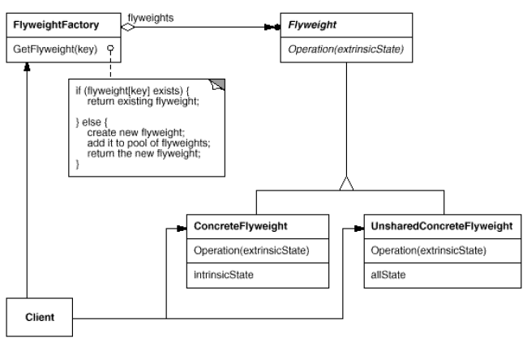

# **Flyweight Pattern** in **C#**

## Overview

This project demonstrates the **Flyweight Pattern** using a practical example of **rendering characters in a text editor efficiently**.

The **Flyweight Pattern** is a **structural** pattern that **enables sharing of fine-grained objects to reduce memory usage while keeping extrinsic state separate**.

In this example, we have:

* **`Client`**: The part of the system that renders text in the editor.
* **`IGlyph`**: The core interface for all glyph objects (characters, rows, columns).
* **`Character`**: A concrete flyweight representing a single character with intrinsic state.
* **`GlyphContext`**: Holds extrinsic state (position, font) for glyphs.
* **`GlyphFactory`**: Manages shared character flyweights and ensures they are reused.

---

## Structure

### Diagram



### 1. Core Interface / Abstract Class

* **`IGlyph`**: Defines the common operation `Draw(GlyphContext context)` for all glyphs.

### 2. Concrete Implementations

* **`Character`**: Stores the intrinsic state (character code) and implements `Draw`.
* **`GlyphContext`**: Holds extrinsic state like position and font.

### 3. Client

* **`DocumentEditor`**: Uses the `IGlyph` interface to render text without knowing concrete glyph implementations.

### 4. Optional Orchestrator

* **`GlyphFactory`**: Ensures character objects are shared, avoiding unnecessary memory allocation.

---

## Example Usage

```csharp
using System;
using System.Collections.Generic;

// Flyweight Interface
interface IGlyph
{
    void Draw(GlyphContext context);
}

// Concrete Flyweight
class Character : IGlyph
{
    private char _charCode;

    public Character(char charCode) => _charCode = charCode;

    public void Draw(GlyphContext context)
    {
        Console.WriteLine($"Drawing '{_charCode}' at position {context.Position} with font {context.Font}");
    }
}

// Extrinsic State
class GlyphContext
{
    public int Position { get; set; }
    public string Font { get; set; }

    public GlyphContext(int position, string font)
    {
        Position = position;
        Font = font;
    }
}

// Flyweight Factory
class GlyphFactory
{
    private Dictionary<char, Character> _characters = new Dictionary<char, Character>();

    public Character GetCharacter(char c)
    {
        if (!_characters.ContainsKey(c))
            _characters[c] = new Character(c);
        return _characters[c];
    }

    public int TotalCharacters() => _characters.Count;
}

// Client
class DocumentEditor
{
    static void Main()
    {
        GlyphFactory factory = new GlyphFactory();
        string text = "flyweight pattern";
        string font = "Arial";
        int position = 0;

        foreach (char c in text)
        {
            Character character = factory.GetCharacter(c);
            GlyphContext context = new GlyphContext(position++, font);
            character.Draw(context);
        }

        Console.WriteLine($"\nTotal unique character objects created: {factory.TotalCharacters()}");
    }
}
```

### Output:

```
Drawing 'f' at position 0 with font Arial
Drawing 'l' at position 1 with font Arial
Drawing 'y' at position 2 with font Arial
Drawing 'w' at position 3 with font Arial
...
Total unique character objects created: 13
```

---

## Benefits

* **Memory Efficiency**: Reduces the number of object instances by sharing intrinsic state.
* **Flexibility and Extensibility**: New characters or glyphs can be added without affecting existing code.
* **Separation of Concerns**: Extrinsic state is separated from intrinsic state.
* **Simplified Client Code**: Clients work with a simple interface and rely on the factory for shared objects.

---

## Common Use Cases

* Rendering large documents or text with many repeated characters.
* Graphical editors with reusable elements like shapes or icons.
* GUI frameworks where many components share similar behavior or appearance.
* Games where multiple objects share textures or sprites.

---

## Implementation Notes

* **Interface vs. Abstract Class**: Use an interface if you only need the `Draw` method; use an abstract class if common behavior exists.
* **Dynamic Switching**: GlyphContext allows changing extrinsic state (position, font) at runtime.
* **Memory vs. Computation Trade-off**: Storing extrinsic state externally saves memory but may add lookup overhead.
